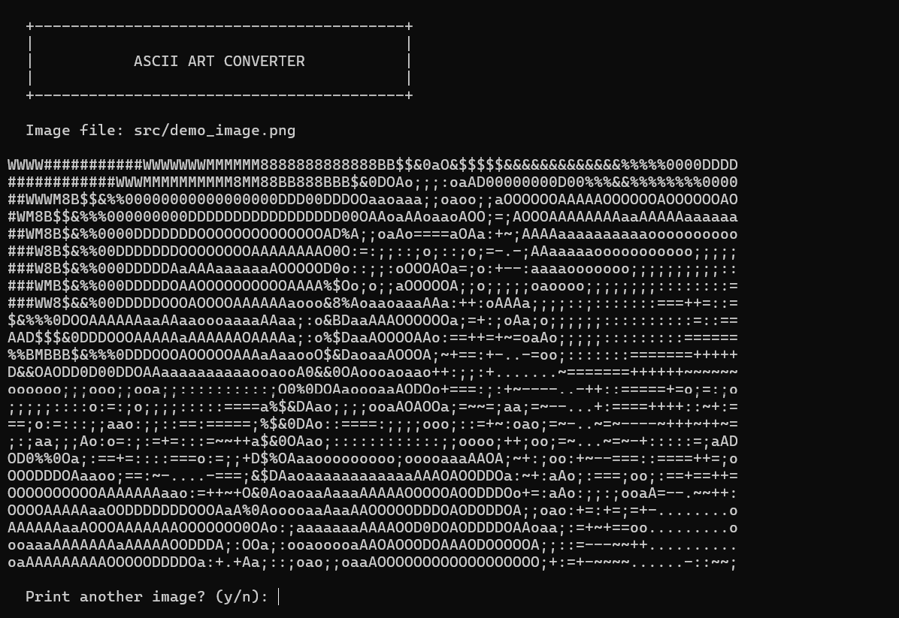

<div align="center">

# ASCII Art in C

**Terminal-based image to ASCII art converter in C**
Converts standard image files into ASCII art rendered directly in the console.

[](https://en.cppreference.com/w/c)
[](https://www.gnu.org/software/make/)
[](https://en.wikipedia.org/wiki/Cross-platform)
[](https://opensource.org/licenses/MIT)

</div>

---

> A terminal program that converts any image file into ASCII art, rendered directly in the console using C and single-header STB libraries.

---

| # | Category | Topics Covered | Files |
|---|----------|-----------------|-------|
| 1 | [Core Source](#core-source) | Main entry point, image processing pipeline, console API | 1 |
| 2 | [Include Headers](#include-headers) | Single-header image loading and resizing libraries | 2 |
| 3 | [Build Configuration](#build-configuration) | GNU Make compilation and environment tasks | 1 |

---

## Core Source

> Path: [`/src`](./src/)

Contains the primary implementation of the ASCII art converter, handling image loading, resizing, character mapping, and console output.

| Project | Description |
|---------|--------------|
| `main.c` | Entry point, CLI handling, image resizing, and terminal printing |

### Demo



### Goals

- Learn how to use external single-header C libraries (`stb_image`, `stb_image_resize2`)
- Understand image representation — channels, pixels, and grayscale conversion
- Practice writing clean, readable C code
- Produce a visible, working output: an ASCII rendering of any input image

### How It Works

At a high level, the program follows this pipeline:

```
Input Image File
      │
      ▼
 Load & Decode (stb_image)
 → grayscale, width, height
      │
      ▼
 Downscale (stb_image_resize2)
 → fits terminal dimensions
      │
      ▼
 Intensity Mapping
 → pixel brightness (0–255) → ASCII character
      │
      ▼
 Print to Terminal
```

### Algorithm Breakdown

#### 1. Define the ASCII Character Set

A string of characters is arranged from darkest (least dense) to brightest (most dense):

```c
char value[] = ".-~+=:;oaAOD0%&$B8MW#@";
```

Characters on the left represent dark/empty regions; characters on the right represent bright/dense regions.

#### 2. Load & Grayscale the Image

Using `stb_image.h`, the image is loaded and immediately converted to a single-channel grayscale representation by passing `1` as the desired channel count:

```c
unsigned char *input_image = stbi_load(image_name, &width, &height, &channel, 1);
```

Each pixel in the resulting buffer is a single `unsigned char` (0 = black, 255 = white).

#### 3. Downscale to Terminal Size

The terminal size is read at runtime using `GetConsoleScreenBufferInfo` (on Windows), and the output dimensions are computed to fill the window while preserving the image's aspect ratio:

```c
int term_cols = get_term_cols();
int term_rows = get_term_rows();
int output_w  = term_cols;
int output_h  = (int)(output_w * ((double)height / width) * 0.45);
if (output_h > term_rows - 6) output_h = term_rows - 6;

stbir_resize_uint8_srgb(input_image, width, height, 0,
                         output_image, output_w, output_h, 0,
                         STBIR_1CHANNEL);
```

> The `0.45` factor corrects for the terminal character aspect ratio — characters are roughly twice as tall as they are wide.

#### 4. Compute & Map Pixel Intensity

For each pixel in the resized image, its grayscale value (0–255) is mapped to an index in the ASCII character array:

```c
int ascii_index = (b * 20) / 255;
printf("%c ", value[ascii_index]);
```

A space is printed after each character to maintain the correct aspect ratio.

#### 5. Print the Image

The nested loop iterates row by row, printing each character and inserting a newline at the end of each row.

### Known Issues & Fixes

| Issue | Status | Notes |
|---|---|---|
| File location problem | In progress | Image must currently be in the same directory as the executable |
| Terminal size problem | Fixed | Output now scales dynamically to terminal width/height via `GetConsoleScreenBufferInfo` |
| Code cleanliness | In progress | `goto` used for loop control; to be refactored |

### Future Improvements

- [ ] Accept image path as a command-line argument (`./ascii_art path/to/image.png`)
- [x] Auto-detect terminal width/height using `GetConsoleScreenBufferInfo` (Windows) or `ioctl` (Unix)
- [ ] Support color ASCII art using ANSI escape codes
- [ ] Cross-platform support (Linux/macOS)
- [ ] Export ASCII output to a `.txt` file

---

## Include Headers

> Path: [`/include`](./include/)

Includes the external single-header libraries utilized for loading, decoding, and resizing image files.

| Project | Description |
|---------|--------------|
| `stb_image.h` | Decodes PNG, JPEG, BMP, and other image file formats into raw pixel buffers |
| `stb_image_resize2.h` | Performs high-quality spatial downsampling of the pixel buffer to fit the terminal |

---

## Build Configuration

> Path: [`.`](./)

Defines the build instructions and automation for compiling the project executable.

| Project | Description |
|---------|--------------|
| `Makefile` | Automates the compilation of `main.c` with appropriate includes and flags |

---

## Tools and Requirements

| Tool | Version | Purpose |
|------|---------|---------|
| [GCC](https://gcc.gnu.org/) | C99 or later | Compiler for C source code |
| [GNU Make](https://www.gnu.org/software/make/) | 3.81 or later | Build automation tool |

---

## Concepts Practiced

```
Image Loading       ████████████████████  Decoding files with stb_image
Image Resizing      ████████████████████  Downsampling with stb_image_resize2
Console API         ███████████████░░░░░  Retrieving terminal dimensions via OS API
ASCII Mapping       ████████████████████  Mapping pixel value ranges to character density
```

---

## Repository Structure

```
ASCII Art in C/
├── include/
│   ├── stb_image.h
│   └── stb_image_resize2.h
├── src/
│   └── main.c
├── Makefile
├── image.png
└── README.md  ← current file
```

---

## Getting Started

1. Install [GCC Compiler](https://gcc.gnu.org/)
2. Clone this repository and navigate to the directory
   ```bash
   git clone https://github.com/USERNAME/REPO.git
   cd "ASCII Art in C"
   ```
3. Compile the application
   ```bash
   make
   ```
4. Run the executable
   ```bash
   ./ascii_art
   ```
5. Enter the filename of an image when prompted:
   ```
   Enter your image name and extension: demo_image.png
   ```

---

## License

This project is licensed under the [MIT License](LICENSE).

---

<div align="center">

Built with C and stb libraries.

Star this repository if it was useful.

</div>
